ColorCheckerProfileGenerator
============================

ColorCheckerProfileGenerator is a standalone Bash script which reads a TIFF
file containing a photo of the ColorChecker Passport and creates an ICC profile.
This profile can then be used by software like AfterShot Pro.

It offers a minimalist GUI using Zenity.

Requirements
------------

This script has been developped and tested on Ubuntu 14.

It requires the following packages to be installed prior to its execution:

- gnome-color-manager (this will also install Argyll CMS)
- Image Magick
- Zenity

Installation
------------

The script should be placed in a directory accessible by the PATH variable. For
example, it can be placed in you ~/bin directory as it does not require special
rights to run.

AfterShot Pro configuration
---------------------------

If you use this script with AfterShot Pro, you can enhance your experience by
creating a new batch output based on the standard "16-bit TIFF" one. Let’s
call it "ColorChecker".

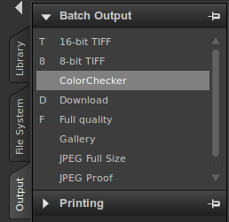

Note: this will work with AfterShot Pro, not standard AfterShot.

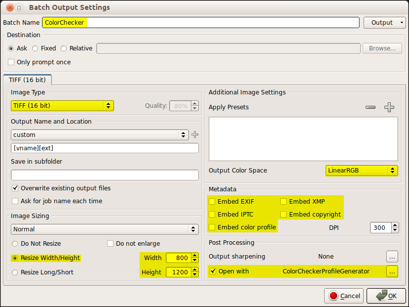

Note: this screen copy was taken from AfterShot Pro 1. AfterShot Pro 2 has the
same abilities but presented differently.

It should have the following settings:

- **Batch Name**: ColorChecker
- **Image Type**: TIFF (16 bit)
- **Output color space**: LinearRGB (you may have to use the "browse" option in
  the combo-box to find it)
- **Metadata**: none
- **Resize Width/Height**: 800/1200 (there is no need to have the full size
  photo)
- **Postprocessing**: open with ColorCheckerProfileGenerator

How to use it
-------------

### Preparing the chart

You should have done a photo of the ColorChecker Passport.

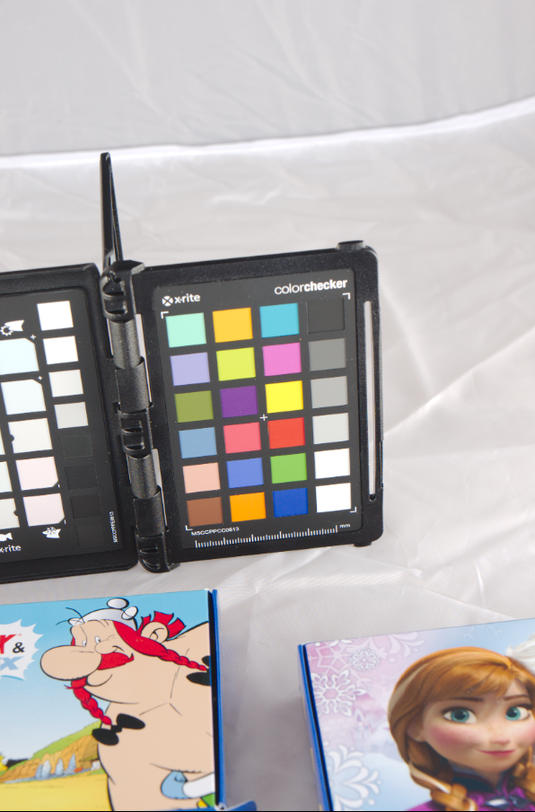

Open the photo in AfterShot Pro. Use the **zPerspector** plugin to make it a
rectangle.

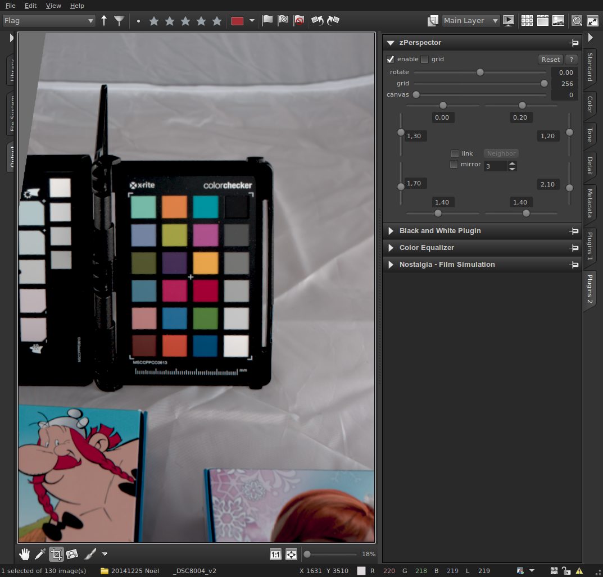

Crop it on the marks

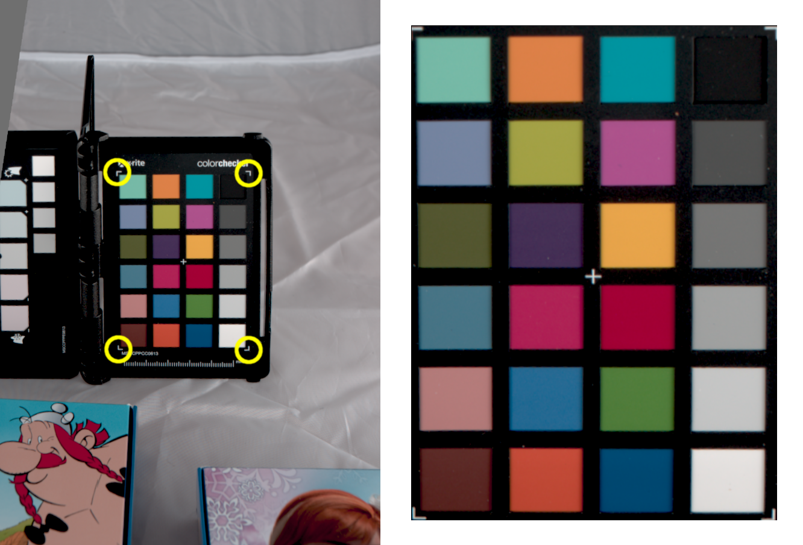

Choose Linear as color management (color tab)

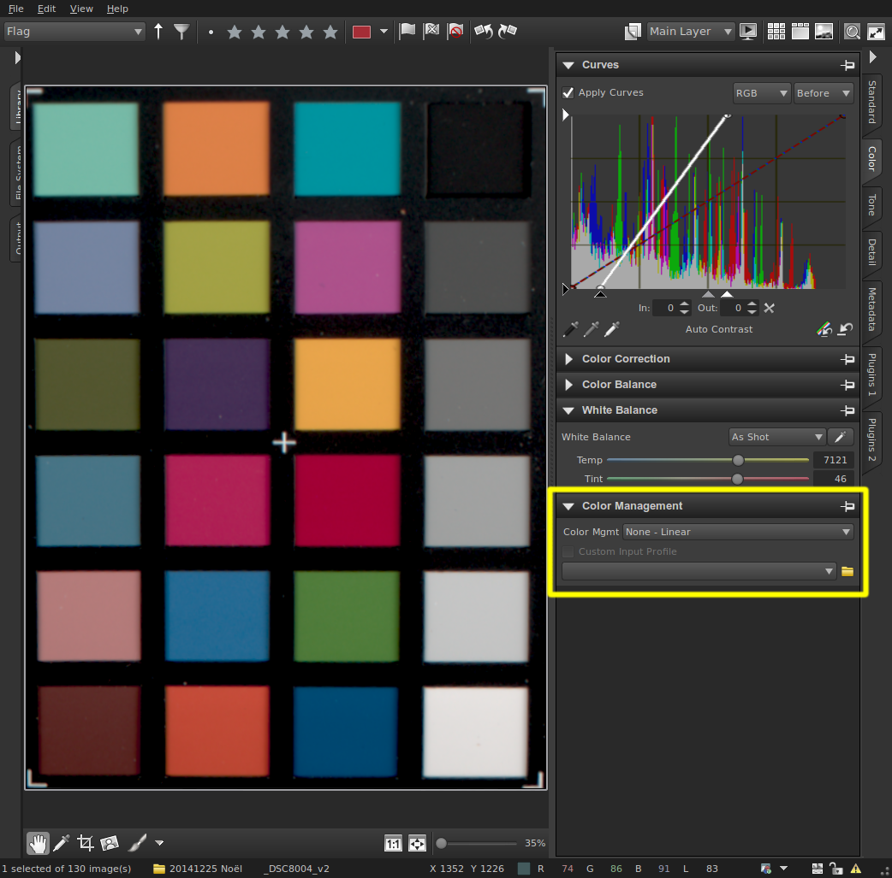

Make sure there is **no correction** which could change colors:

- saturation,
- vibration,
- contrast,
- sharpening,
- tone control,
- noise reduction,
- etc.

Using the Curves tool, correct the luminosity of the black and white patches.

When hovering your pointer over the patches, you can read the luminosity under
it (the number on the right of "L" at the window bottom).

You should have approximately the following values :

- **black patch**: 50
- **white patch**: 241

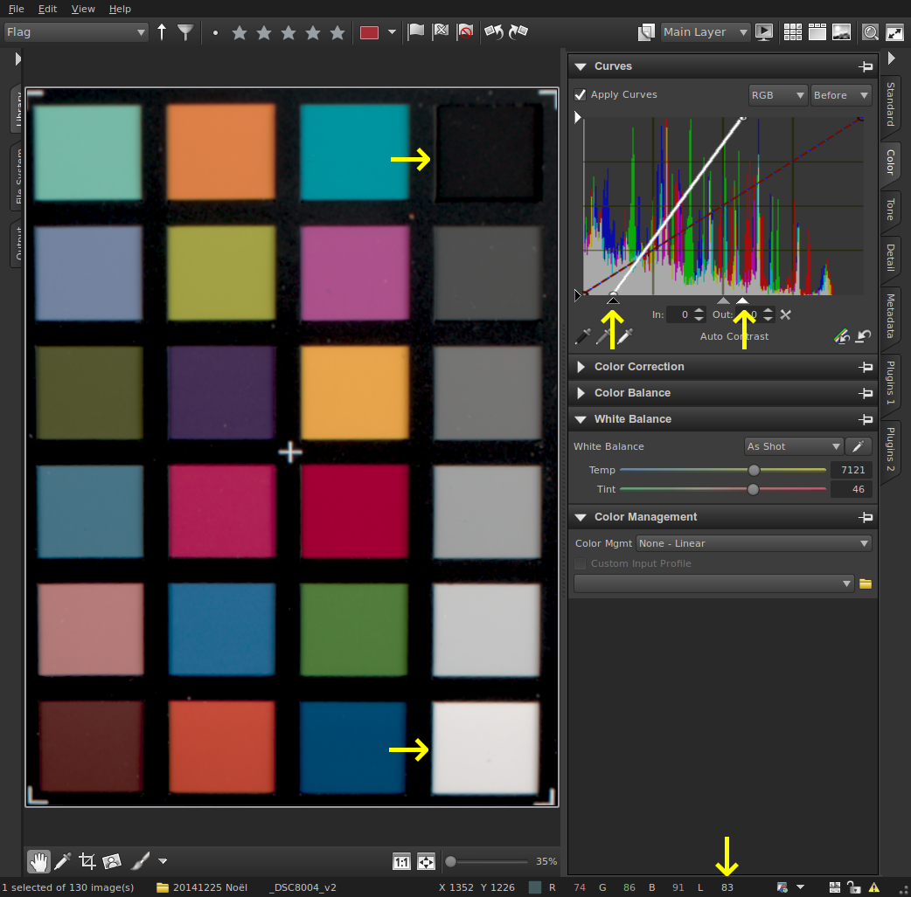

Note: use only the black and white triangle cursors of the curves tool.

### Generating the profile

Use the ColorChecker batch output profile "ColorChecker" previously created.
When AfterShot Pro has finished generated the TIFF file, it will automatically
run the ColorCheckerProfileGenerator script.

This, in turn, will ask you to enter the following values:

- Camera name
- Description
- Copyright (the author)
- ICC profile name

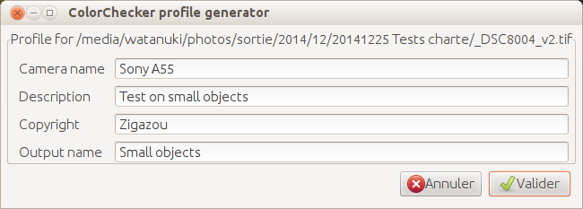

Note: You can use accents or special characters (except "/" for the ICC profile
name as it will be used as the file name).

When the profile is generated, the Gnome Color Manager Viewer is launched with
it so you can check if your newly generated profile seems correct.

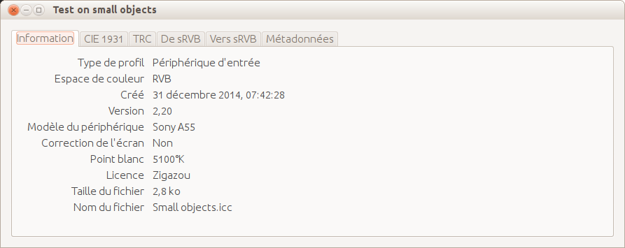

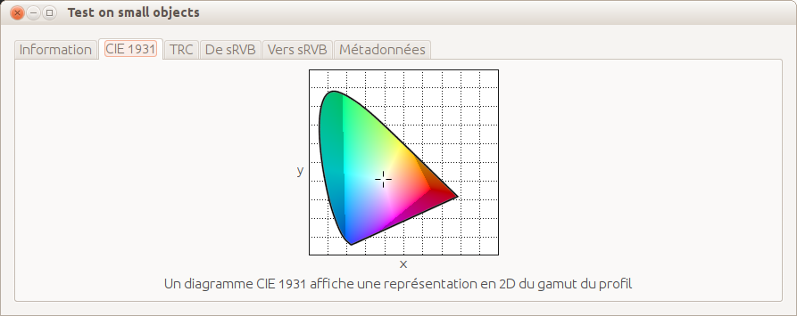

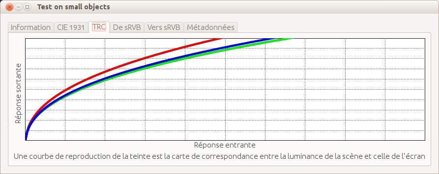

Notes
-----

I’ve not been able to make scanin automatically recognize the ColorChecker
position in the photo, this is why you have to crop it.

I cannot make Zenity remember the previous values for each field, you have to
type all the values every time you use it (in order to do it, this project
would be more complex than it is today).

